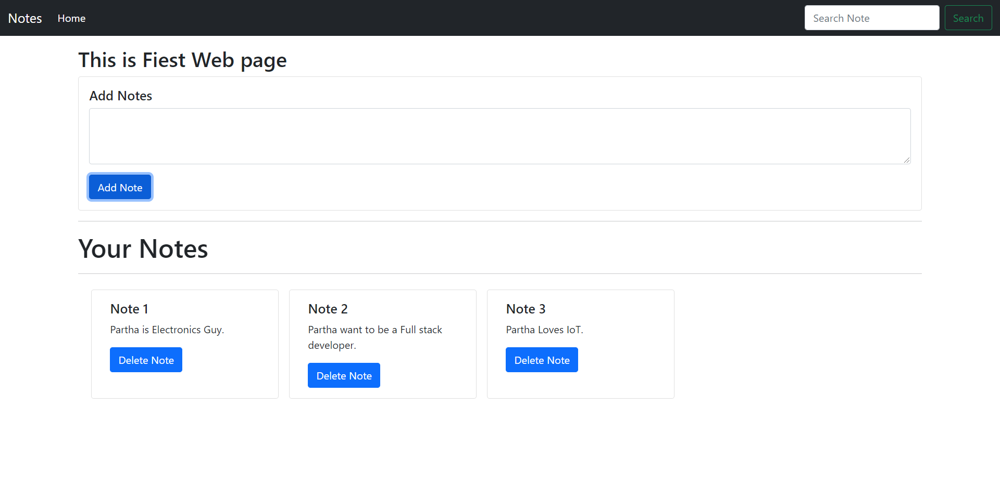

# **MaP-In-JS**
This is a demo project based on **Vanilla JavaScript** .

## **Contents**
1. [Description](#description)
0. [Installation](#installation)
0. [Languages](#languages)
0. [Contribution](#contribution)

## **Description**
It will develop a simple note-taking application using HTML, Bootstrap, and Vanilla JavaScript, in which we can add, delete and search for our notes. The notes will be stored in the local storage of the web browser and they will not be deleted even if the browser is closed. The application will also prevent HTML and script injections via the input field.

<!-- img -->

### How this Project will Help Us?
This project will help Fontend developers to understanding HTML,CSS and Bootstrap and implementing them with **Javascript** as well as provide an insight to the working of a basic **Javascript** system.

## **Installation**
### Softeares Required :

- [visual Studio Code](https://code.visualstudio.com/download)

- [Live Server](https://marketplace.visualstudio.com/items?itemName=ritwickdey.LiveServer)

___Just install Live Server from VS Code extensions, open the repository on VS code and start working on the index.html .___

## **Languages**

- 
 

## **Projects Picture :**
- 
 

## **Contribution**
This is a concept for beginners starting with **JS**. Feel free to fork, clone, create issues and/or make PRs. We will be more than happy to receive your contributions.
